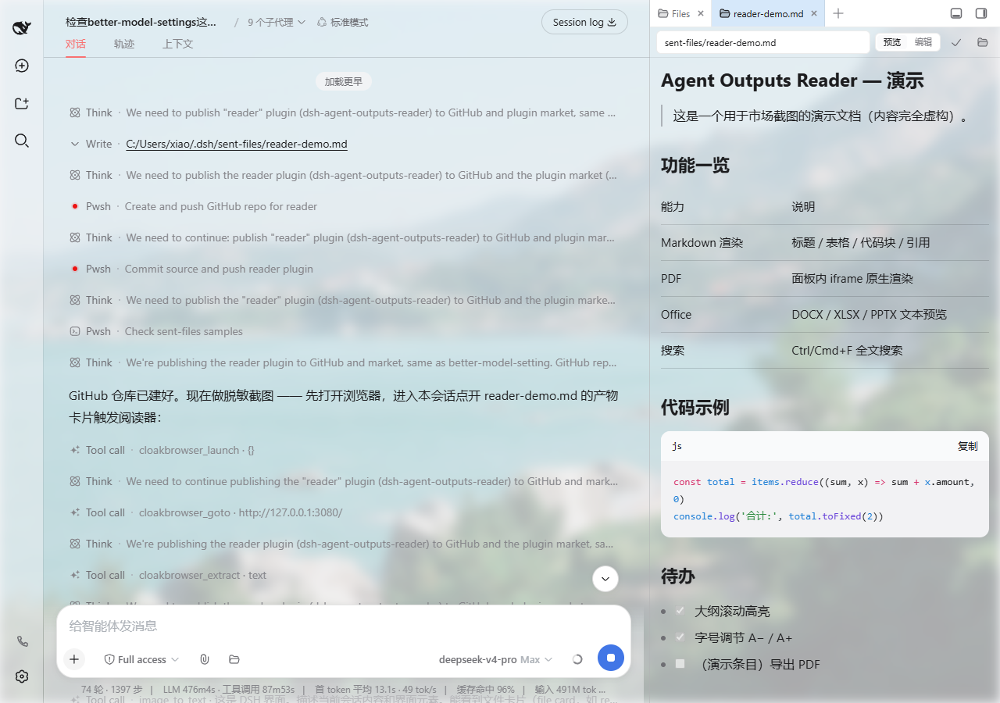
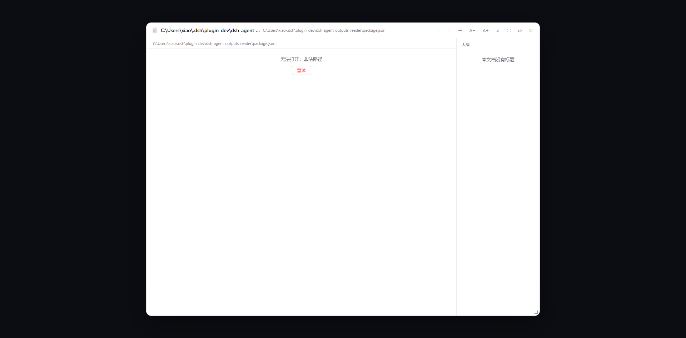
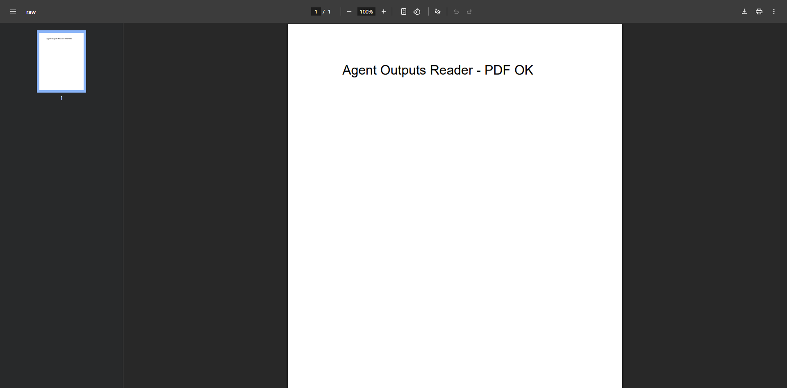

# dsh-agent-outputs-reader

**无任何常驻 UI**。定位：阅读 **agent 产出的任何文件**——文本/markdown、PDF、DOCX/XLSX/PPTX。

## 截图 / Screenshots

### 会话中的产物文件卡片 / File cards in conversation


### 阅读器浮层（目录树 + 大纲 + 工具栏）/ Reader overlay


### Markdown 渲染 / Markdown rendering


### PDF 面板渲染 / In-panel PDF


## 两个入口

1. **回复末尾文件 chips**：agent 在回复末尾写文件链接（≤3 个自定），渲染为紧凑胶囊按钮，点击打开阅读器。必须用绝对 http URL（GUI 渲染器只对 http/https/mailto 出可点链接），路径须 encodeURIComponent。
2. **产物文件卡片**：agent 写入会话工作区（`sent-files/`）的文件自动挂在回复下方，点击进入阅读器；工作区任意 .md 也可直达。

## 阅读器

- 文本类：GFM 子集渲染（标题/表格/代码块/引用/列表/加粗斜体/行内代码/链接）、限宽排版、大纲滚动高亮、全文搜索（Ctrl/Cmd+F）、字号 A−/A+、位置记忆、上一篇/下一篇（边界禁用）、返回顶部、宽屏
- **PDF**：面板内 iframe 原生渲染（宿主 `/raw` 出字节）
- **DOCX/XLSX/PPTX**：面板内**文本预览**（宿主纯 JS 解 zip + XML 提取；xlsx 含 sharedStrings、pptx 按页分组）；不支持 .xls/.doc 旧二进制格式（这类文件请在本地打开）
- 窗口：拖拽调整大小、吸附右侧 ⤇ / 一键恢复弹窗 ⤆、Esc 关闭；快捷键不抢占对话输入框
- 失败路径可自救：根目录不可用/目录树失败/文件失败均有提示与重试

## 宿主 API（同源校验：Host/Origin 仅 127.0.0.1/localhost/::1）

新前缀 `/@dsh-external/dsh-agent-outputs-reader/api/*`；旧前缀 `/@dsh-external/dsh-report-card/api/*` 保留注册（历史 chips 兼容）。

- `GET /info` → `{ ok, root, roots, exps, limits, suggest }`
- `GET /tree?path=<rel>` → `{ root, path, entries }`（链接条目 type:'link'）
- `GET /file?path=<rel>` → 文本 `{type:'text',content}` | office `{type:'office',kind,text}` | pdf `{type:'pdf',rawUrl}`；浏览器直开返回 HTML 兜底
- `GET /raw?path=<rel>` → PDF 原始字节（application/pdf）
- `GET /beacon?msg=…` → 诊断日志（净化/截断/超 1MB 轮转）

路径三根：`config.root` > env `DSH_REPORTS_ROOT` > `C:\Projects\Quant\reports`；`sent-files/` → `$DSH_HOME/sent-files`；`$DSH_HOME`（仅 .md/.markdown）。全部经 realpath 校验防 junction 穿透。白名单 = 文本扩展名 + .pdf/.docx/.xlsx/.pptx；≤10MB。

## 构建 / 测试 / 注入

```bash
bash scripts/build.sh       # src→lib 拷贝 + 语法自检 + 一致性校验
node --test tests/*.cjs     # 回归测试
```

经 dsh-super-injector 注入：`dev_inject_plugin`（目录 `C:\Users\xiao\.dsh\plugin-dev\dsh-agent-outputs-reader`）；热重载 `dev_reload_package dsh-agent-outputs-reader`；卸载 `dev_uninject_plugin dsh-agent-outputs-reader`。

## 运维 / 排障

- 持久化：`$DSH_HOME/sent-files/`、`$DSH_HOME/dsh-agent-outputs-reader-beacon.log`（自动轮转 .old）
- localStorage：`dsh-aor:*` 前缀（旧 `dsh-report-card:*` 键自动迁移）
- 高频排障：chips 不可点 → 检查是否 http 链接；点卡片不弹阅读器 → 硬刷新页面；接口 403 → 来源非本机
- 仅支持 Windows（默认根为 Windows 路径，其它平台需显式配 `DSH_REPORTS_ROOT`）

## 设计决策

- 无任何常驻 UI：chips 随消息流滚动，由 agent 逐条回复自定
- 无条件 `window.__ModuleLoader__.load` 注册：守卫写法会静默跳过导致整个 web 插件树启动失败（历史事故，回归测试锁定）
- 拦截层三层：chips 链接（DOM 捕获）+ 产物卡片（title 路径兜底）+ `ctx.workspaces.openPath` 包装（卸载前身份校验）
- 零依赖：Office 解析用自研最小 zip 读取器（stored + deflate），换取纯拷贝构建
- 旧接口路径保留：改名不破坏历史消息里的链接
